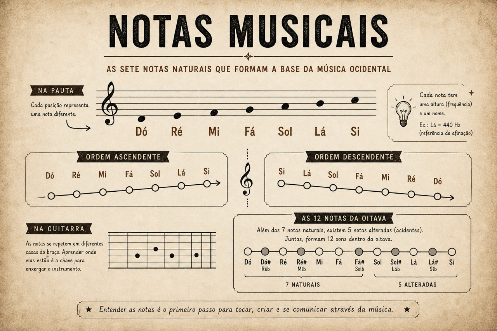
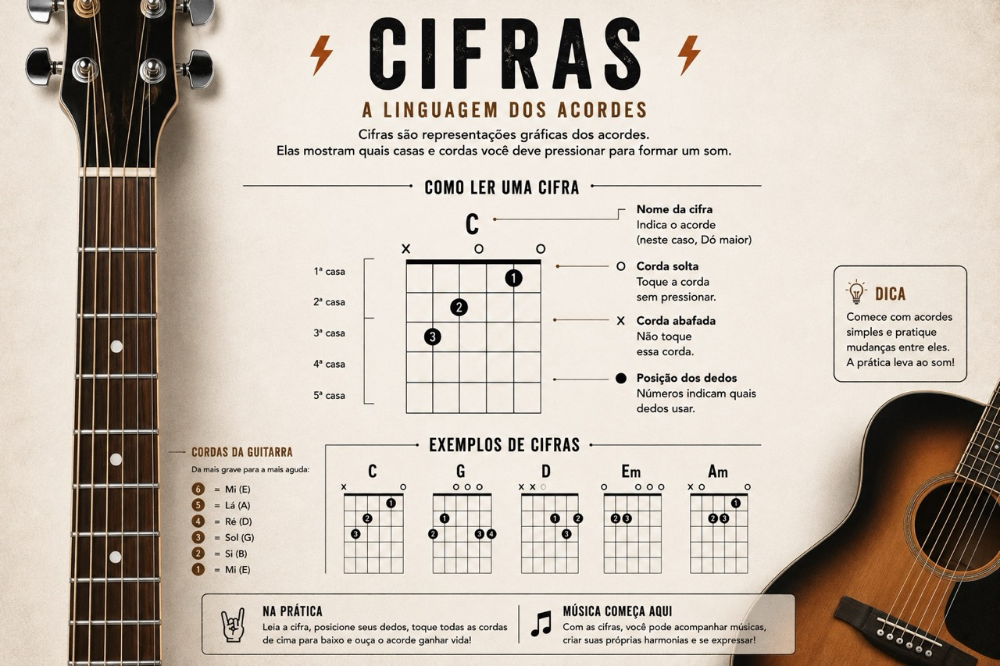

# Conceitos básicos
{: .no_toc }

Os primeiros conceitos musicais parecem simples no papel, mas é aqui que a base começa a ser construída. Se essa parte fica vaga, o resto tende a virar decoreba.
{: .fs-6 .fw-300 }

## Tópicos
{: .no_toc .text-delta }

1. TOC
{:toc}

---

## Notas musicais

Quando começamos a estudar música, as notas são o ponto de partida. São os nomes que usamos para organizar sons diferentes, quase como um alfabeto.

Na música ocidental, trabalhamos com 7 notas naturais:

`Dó`, `Ré`, `Mi`, `Fá`, `Sol`, `Lá` e `Si`.

Vale saber lê-las nas duas direções:

- Ascendente: `Dó`, `Ré`, `Mi`, `Fá`, `Sol`, `Lá`, `Si`
- Descendente: `Si`, `Lá`, `Sol`, `Fá`, `Mi`, `Ré`, `Dó`

Cada nota está ligada a uma altura sonora. Em termos físicos, isso significa uma frequência medida em Hertz (Hz). O Lá usado como referência de afinação costuma ser o Lá 440 Hz.

No papel, isso aparece na partitura. Ali, cada símbolo indica altura e duração. Semibreve, mínima, semínima, colcheia e semicolcheia são alguns exemplos de valores rítmicos.

As notas não aparecem sozinhas por muito tempo. Elas formam escalas, e é daí que vêm boa parte das sensações que associamos à música: estabilidade, tensão, repouso, expectativa.

Mais adiante, isso vai fazer diferença quando começarmos a reconhecer padrões no braço da guitarra. Por agora, o essencial é perceber que nomear as notas ajuda a enxergar a estrutura por trás do som.

Além das 7 notas naturais, existem mais 5 notas alteradas, conhecidas como acidentes musicais. No sistema ocidental, isso fecha 12 sons dentro da oitava.

---

## Cifras

Se as notas são o alfabeto, as cifras são um atalho para os acordes.

Elas representam acordes usando letras e símbolos. Em vez de escrever todas as notas de um acorde, usamos uma notação mais simples para tocar acompanhamento.

Por exemplo:

- `C` representa o acorde de Dó maior.
- `Am` representa o acorde de Lá menor.

Isso parece pequeno, mas muda a forma como a música é lida. Em vez de depender de uma partitura completa, o músico consegue acompanhar uma canção com rapidez. Por isso, cifras são tão comuns entre guitarristas e violonistas.

As cifras normalmente indicam apenas o acorde. Elas não mostram toda a melodia nem explicam exatamente o ritmo do acompanhamento. Dizem o que tocar, mas não entregam tudo sobre como tocar.

Isso é uma limitação, mas também uma liberdade. A mesma progressão pode ser tocada de maneiras diferentes, com ritmos, levadas e sonoridades distintas. A cifra funciona como um mapa, não como uma gravação pronta.

Alguns símbolos aparecem junto das cifras para indicar variações, como acordes menores, sétimas e outras tensões. Aos poucos, isso amplia o vocabulário sem mudar a lógica principal: cada símbolo aponta para uma harmonia específica.

Uma forma prática de lembrar a equivalência entre notas e cifras é esta:

| Nota | Cifra |
| :--: | :---: |
| Dó   | C     |
| Ré   | D     |
| Mi   | E     |
| Fá   | F     |
| Sol  | G     |
| Lá   | A     |
| Si   | B     |

Quando entendemos essa correspondência, tudo fica menos misterioso. O braço da guitarra deixa de parecer um conjunto de casas soltas e passa a ter sentido. Essa clareza vale mais do que decorar meia dúzia de acordes isolados.
