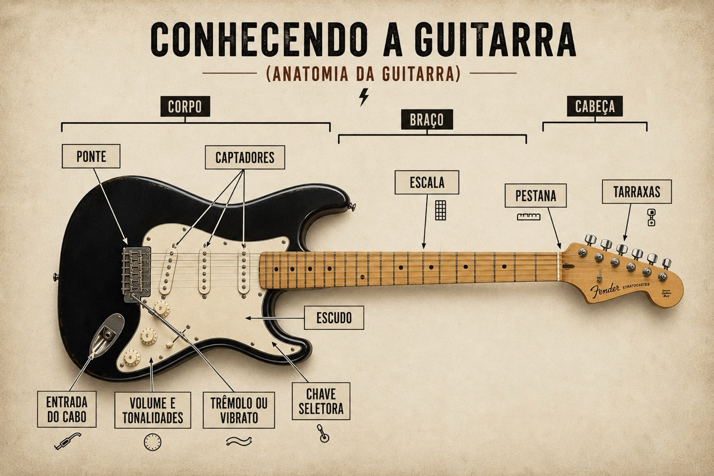
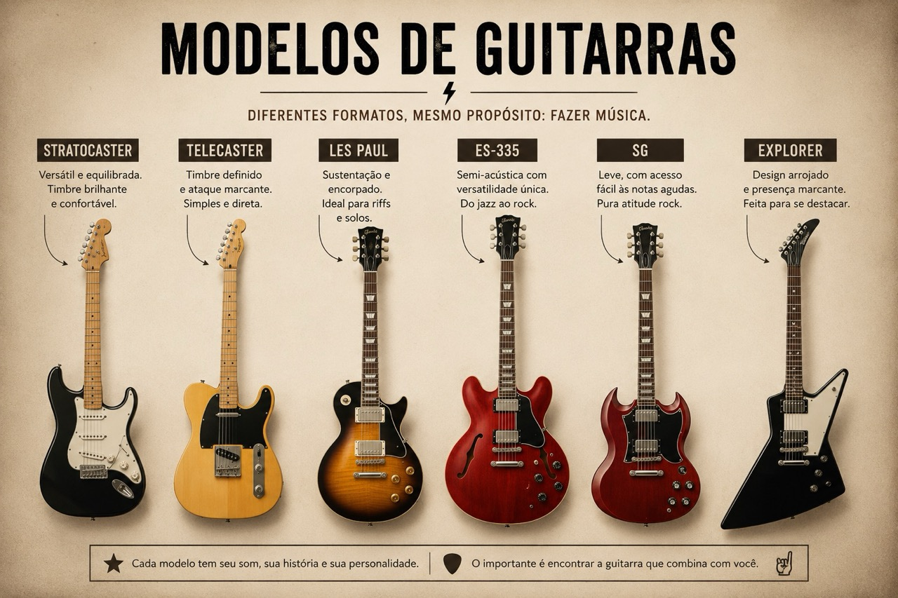

# Anatomia da Guitarra
{: .no_toc }

TODO: TEXTO LEAD

---

## Tópicos
{: .no_toc .text-delta }

1. TOC
{:toc}

---

## Conhecendo a guitarra (anatomia da guitarra)

Conhecer as partes da guitarra evita muita confusão no começo. Quando alguém fala "captador da ponte", "regular o tensor", "abaixar a ação" ou "abrir o tone", fica mais fácil acompanhar se você sabe onde cada peça fica.

O corpo é a base do instrumento. Nele ficam a ponte, os captadores, os controles de volume e tonalidade, a chave seletora e a entrada do cabo. O formato do corpo muda a ergonomia e, junto com a construção, influencia a resposta do instrumento.

O braço é onde as notas acontecem. A escala fica colada sobre o braço, e os trastes dividem o caminho das notas. As marcações ajudam a localizar casas que aparecem bastante, como 3, 5, 7, 9 e 12.

A cabeça, ou headstock, segura as tarraxas. Elas ajustam a tensão das cordas e, por consequência, a afinação. A pestana fica entre a cabeça e a escala. Ela parece uma peça pequena, mas influencia afinação, altura das cordas e conforto nas primeiras casas.

Os captadores pegam a vibração das cordas e enviam esse sinal para o amplificador. Captadores single coil costumam soar mais abertos e brilhantes. Humbuckers tendem a ter mais corpo e menos ruído. Não é uma regra absoluta, mas é um bom ponto de partida.

Um jeito simples de estudar a anatomia é pegar a guitarra desligada e nomear cada parte. Parece bobo, mas ajuda quando você começa a ler sobre regulagem, timbre e manutenção.

- Corpo
  - Captadores: braço, meio e ponte
  - Tipos de captador: single coil, humbucker, ativo e passivo
  - Chave seletora
  - Volume
  - Tonalidade (tone)
  - Entrada do cabo P10 (jack)
  - Ponte: fixa, tremolo, flutuante (Floyd Rose) e Evertune
    - Alavanca
- Braço
  - Escala
  - Trastes
  - Marcações (dots)
  - Pestana (nut): plástico, osso ou latão
  - Cabeça (headstock)
    - Tarraxas

---

## Modelos de guitarras

Modelo de guitarra também mexe com tocabilidade e som. O formato do corpo, a ponte, a escala, a posição dos captadores e o tipo de madeira mudam a sensação de tocar e o resultado no amplificador.

Alguns modelos aparecem com frequência porque viraram referência:

- Stratocaster: corpo confortável, três captadores single coil em muitos modelos e ponte com alavanca. É muito associada a blues, rock, funk e pop.
- Telecaster: construção simples, som direto e bastante ataque. Aparece muito em country, rock, blues e indie.
- Les Paul: corpo mais pesado, escala mais curta e, em geral, humbuckers. Costuma ter som encorpado, com bastante sustain.
- SG: mais leve que a Les Paul, com acesso fácil às casas agudas. Muito comum em rock.
- Superstrato: variação moderna inspirada na Stratocaster, geralmente com humbuckers, ponte flutuante e foco em técnica mais rápida.
- Hollowbody: corpo oco, som mais acústico e ressonante. Muito usada em jazz e blues.
- Semi-hollowbody: meio termo entre corpo sólido e oco. Mantém parte da ressonância, mas lida melhor com volumes mais altos.

Para quem está começando, o melhor modelo é o que dá vontade de pegar e estudar. Com mais ouvido e repertório, fica mais fácil entender por que uma guitarra combina melhor com certo som.
