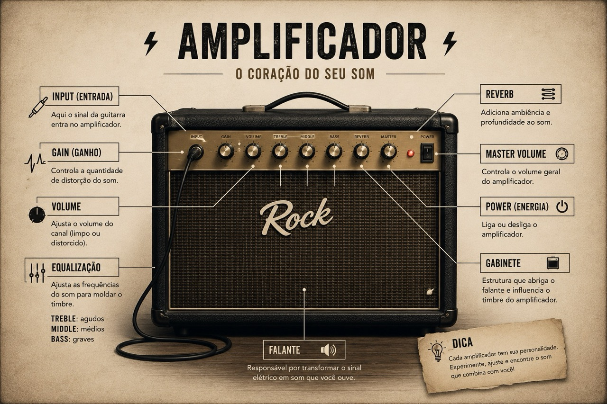
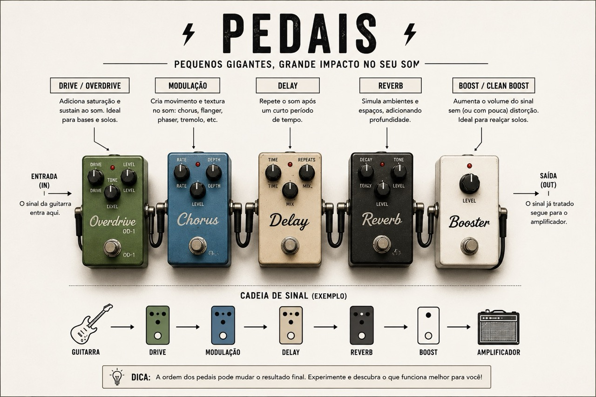
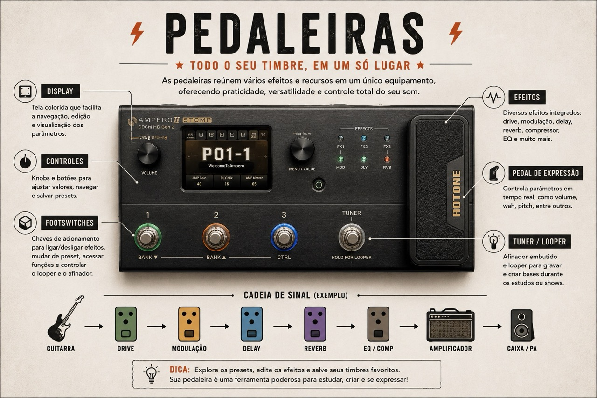
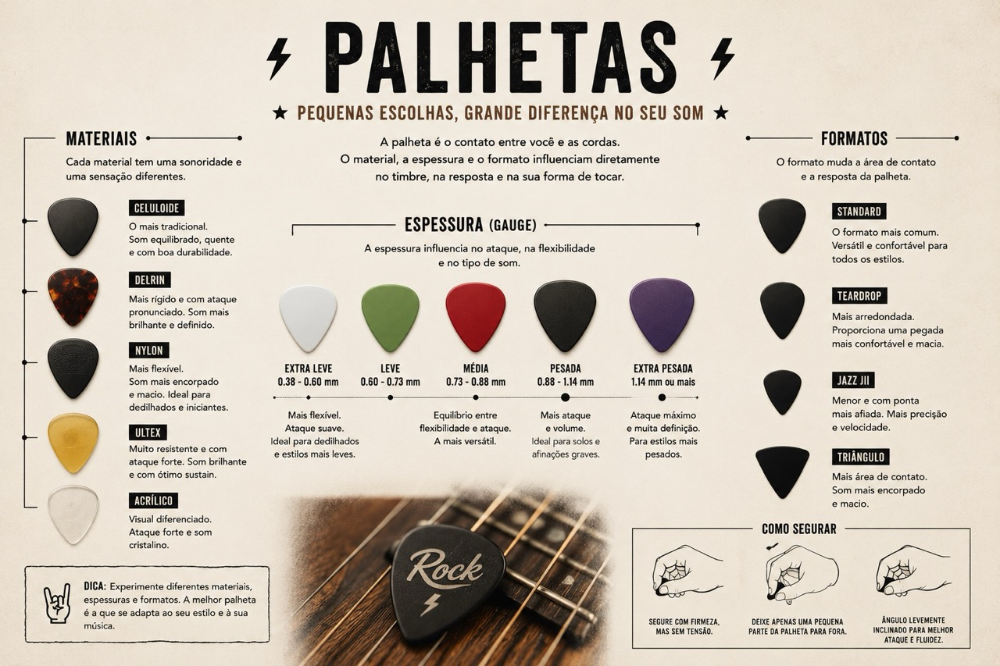

# Equipamentos Essenciais
{: .no_toc }

TODO: TEXTO LEAD

---

## Tópicos
{: .no_toc .text-delta }

1. TOC
{:toc}

---

## O indispensável

- Guitarra
- Cabo
- Amplificador
- Palheta
- Afinador

## O recomendado

- Correia
- Suporte
- Capa ou case
- Metrônomo
- Banco ou cadeira adequada

## Primeiros acessórios (opcional)

- Pedal de distorção
- Fonte
- Pedal de afinação

---

## Amplificador

O amplificador deixa a guitarra mais alta, mas também muda o timbre. Ele faz parte do som.

A guitarra envia um sinal fraco pelos captadores. O amplificador recebe esse sinal, aumenta o volume e colore o som. Por isso a mesma guitarra pode soar limpa, estalada, encorpada ou distorcida dependendo do amplificador e da regulagem.

Os controles mais comuns são volume, ganho e equalização. O ganho define quanto o sinal entra limpo ou saturado. A equalização ajusta graves, médios e agudos. Em muitos estilos, mexer nesses três controles ensina mais sobre timbre do que trocar equipamento.

Também existem amplificadores valvulados, transistorizados, digitais, combos e stacks. No começo, ajuda entender a cadeia básica: guitarra, cabo, amplificador e alto-falante.

- Input
- Drive
- Equalizador (grave, médio e agudo)
- Master
- Saída
- Alto-falante
- Valvulados vs transistorizados
- Combo ou stack

---

## Pedal

Pedais mudam o sinal da guitarra antes de ele chegar ao amplificador. Um pedal pode empurrar o amp, distorcer o som, repetir notas, simular espaço ou filtrar frequências.

Normalmente um pedal faz uma função principal. Isso ajuda a montar o som por partes. Você pode usar um overdrive para empurrar o amplificador, um delay para repetir frases e um reverb para dar sensação de ambiente.

Alguns tipos comuns:

- Overdrive: satura o som de forma mais leve. Muito usado em blues, rock e worship.
- Distortion: cria uma saturação mais forte. Aparece bastante em rock e metal.
- Fuzz: distorção mais comprimida e áspera, com som bem característico.
- Delay: repete o som tocado, como um eco controlado.
- Reverb: simula a ambiência de um espaço.
- Chorus: dobra e modula o sinal. O som fica mais largo.
- Wah-wah: altera frequências com o movimento do pedal.
- Phaser: cria um movimento ondulado no som.

Uma boa prática é testar um efeito por vez. Quando tudo fica ligado ao mesmo tempo, fica difícil saber o que cada coisa está fazendo.

---

## Pedaleira

Pedaleira junta vários efeitos em um único equipamento. Em vez de comprar pedal por pedal, você usa presets com combinações de overdrive, delay, reverb, modulação e outros efeitos.

Muitas pedaleiras também simulam amplificadores e caixas. Isso permite estudar com fone, gravar direto no computador ou tocar ligado em uma mesa de som.

A vantagem é praticidade. A desvantagem é que alguns modelos envelhecem mais rápido, principalmente quando dependem de tecnologia digital. Mesmo assim, para estudo e primeiros shows, uma boa pedaleira resolve muita coisa com menos custo e menos cabos.

O cuidado é não virar colecionador de preset antes de entender o som básico. Primeiro tente montar um timbre limpo, um crunch, uma distorção e um som com delay. Isso já cobre bastante repertório.

---

## Palheta

A palheta parece detalhe, mas muda bastante o ataque. Uma palheta fina dobra mais e costuma soar mais leve. Uma palheta grossa responde com mais firmeza e pode dar mais precisão em riffs, palhetada alternada e solos.

Material, formato e ponta também contam. Nylon, celuloide, tortex, ultex e acrílico têm sensações diferentes. A melhor forma de escolher é comprar algumas espessuras e tocar o mesmo exercício com todas.

Eu gosto de usar Dunlop Ultex Sharp 1.14, mas isso é gosto pessoal. O ponto é perceber como a palheta muda sua relação com a corda. Às vezes o problema não está no exercício. Está na ferramenta que você escolheu para atacar a corda.

Pontos para testar:

- Material
- Espessura
- Tamanho
- Formato da ponta
- Aderência
