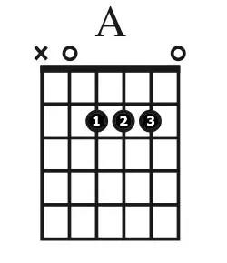

# Diagrama
{: .no_toc }

Conhecendo o diagrama de acordes.
{: .fs-6 .fw-300 }

## Tópicos
{: .no_toc .text-delta }

1. TOC
{:toc}

---

Ferramenta de notação musical, que representa um acorde.



A barra mais grossa é a representação da pestana (nut).

As linhas verticais representam as cordas: e, B, G, D, A, E.

As linhas horizontais representam os trates (casas).

O número representa qual dedo da mão digitadora usar e a casa onde está o número qual casa deve apertar.

Os circulos atrás da pestana (nut) representam a corda solta.

O X representa que a corda não deve ser tocada.

## O que é o diagrama de acorde?

O diagrama de acorde é uma representação visual de um acorde de guitarra que mostra a posição dos dedos nas cordas e trastes do braço da guitarra. Ele é uma forma útil de aprendizado para iniciantes e guitarristas avançados, pois permite que você visualize as notas e as posições dos dedos necessárias para formar um acorde específico.

Os diagramas de acorde geralmente apresentam um diagrama de seis linhas horizontais que representam as seis cordas da guitarra, com um número no topo que indica o traste em que o acorde deve ser tocado. Círculos vazios ou preenchidos são colocados em cima das linhas para indicar em quais trastes e cordas os dedos devem ser colocados para formar o acorde.

Além disso, os diagramas de acordes podem incluir símbolos que indicam qual é a corda de base do acorde, a corda que deve ser tocada primeiro, e quais dedos devem ser usados para tocar cada nota. Esses símbolos podem variar de acordo com o método ou estilo de notação utilizado, mas a maioria dos diagramas de acordes contém informações suficientes para ajudar um guitarrista a aprender e tocar um acorde específico.

## Exemplo de diagrama de acorde

Aqui está um exemplo de um diagrama de acorde para um acorde de Dó Maior (C Major):

```
   C
e|---0---|
B|---1---|
G|---0---|
D|---2---|
A|---3---|
E|-------|
```

Neste exemplo, a linha superior representa a corda mais aguda (E) e a linha inferior representa a corda mais grave (E). O número no topo do diagrama indica qual traste deve ser tocado para cada corda, e os círculos preenchidos representam os dedos que devem ser usados para pressionar as cordas nos trastes indicados.

Para tocar este acorde, você colocaria seu dedo indicador na primeira casa da segunda corda, o dedo médio na segunda casa da quarta corda e o dedo anelar na terceira casa da quinta corda. As outras cordas são tocadas abertas (sem nenhum dedo pressionando-as).

Lembre-se de que existem muitas variações de diagramas de acordes dependendo do estilo de notação utilizado, mas a ideia geral é a mesma.

## Como ler um diagrama de acorde

Para ler um diagrama de acorde, é importante entender a estrutura do diagrama. Em geral, um diagrama de acorde é composto por uma representação visual das cordas da guitarra e pontos ou círculos indicando onde os dedos devem ser colocados para formar o acorde.

Aqui está um exemplo de um diagrama de acorde para um acorde de Dó Maior (C Major):

```
   C
e|---0---|
B|---1---|
G|---0---|
D|---2---|
A|---3---|
E|-------|
```

Neste exemplo, a linha superior representa a corda mais aguda (E) e a linha inferior representa a corda mais grave (E). O número no topo do diagrama indica qual traste deve ser tocado para cada corda, e os círculos preenchidos representam os dedos que devem ser usados para pressionar as cordas nos trastes indicados.

Para tocar este acorde, você colocaria seu dedo indicador na primeira casa da segunda corda, o dedo médio na segunda casa da quarta corda e o dedo anelar na terceira casa da quinta corda. As outras cordas são tocadas abertas (sem nenhum dedo pressionando-as).

Lembre-se de que existem muitas variações de diagramas de acordes dependendo do estilo de notação utilizado, mas a ideia geral é a mesma. Com um pouco de prática, você poderá ler e tocar qualquer diagrama de acorde que encontrar.
