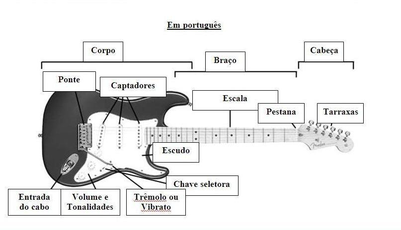

# A guitarra
{: .no_toc }

Existem muitos tipos diferentes de guitarras, desde as clássicas acústicas até as elétricas modernas.
{: .fs-6 .fw-300 }

## Tópicos
{: .no_toc .text-delta }

1. TOC
{:toc}

---

## História da guitarra

A guitarra elétrica é um instrumento derivado do violão.

Em 1880 teve uma crise do violão erudito das demandas de prática em grupo.

O primeiro modelo economicamente viável foi inventado pelo músico George Beauchamp e o engenheiro elétrico Adolph Rickenbacker em 1934.

Em 1950 Leo Fender lançou o seu primeiro modelo de guitarra a Telecaster e em 1954 lança o modelo Stratocaster.

As primeiras guitarras do modelo Les Paul, começaram a ser vendidas em 1952, desenvolvida pelo engenheiro John Huis em conjunto com o guitarrista Les Paul.

A história das guitarras elétricas remonta ao final do século XIX e início do século XX. Na época, os músicos de jazz e de blues estavam procurando uma maneira de amplificar o som de suas guitarras, para que pudessem ser ouvidos em grandes salões de dança e em gravações.

A primeira guitarra elétrica conhecida foi desenvolvida em 1931 pela empresa Rickenbacker, nos Estados Unidos. Esta guitarra, chamada de "Frying Pan" ("frigideira", em inglês) devido ao seu formato, utilizava um captador magnético para converter as vibrações das cordas em um sinal elétrico, que era então amplificado por um amplificador de válvulas.

Nos anos seguintes, outras empresas começaram a fabricar guitarras elétricas, como a Gibson e a Fender. Estas empresas introduziram novas tecnologias, como captadores de bobina dupla, que eliminavam os ruídos eletromagnéticos e produziam um som mais limpo e nítido.

Na década de 1950, a música rock começou a se tornar popular, e as guitarras elétricas tornaram-se o instrumento de escolha dos músicos deste gênero. Guitarristas famosos, como Chuck Berry, Jimi Hendrix, Eric Clapton e Jimmy Page, ajudaram a popularizar as guitarras elétricas, e as empresas continuaram a inovar, introduzindo novos modelos e designs.

Hoje em dia, as guitarras elétricas continuam a evoluir, com novas tecnologias, como os captadores ativos, que utilizam baterias para amplificar o sinal elétrico, e os modelos híbridos, que combinam as características das guitarras elétricas e acústicas. A guitarra elétrica é um instrumento essencial na música moderna e sua história é fascinante e rica em inovação.

---

## Conhecendo a guitarra (anatomia da guitarra)

A guitarra elétrica tem uma anatomia distintiva, com várias partes que trabalham juntas para produzir seu som característico. Aqui estão as principais partes da guitarra elétrica:

Corpo: o corpo da guitarra elétrica é geralmente feito de madeira, embora outros materiais, como plástico ou metal, também possam ser usados. Ele é a base da guitarra e pode ter uma variedade de formas e tamanhos, dependendo do modelo.

Braço: o braço é a parte da guitarra que se estende do corpo e onde as cordas são pressionadas para produzir notas. Ele é geralmente feito de madeira e é coberto por um braço de metal, que ajuda a produzir um som mais brilhante e sustentado. O braço também pode ter trastes, pequenas tiras de metal que ajudam o guitarrista a pressionar as cordas com precisão.

Cabeça: a cabeça é a parte superior do braço da guitarra, onde as tarraxas são fixadas. As tarraxas são usadas para ajustar a tensão das cordas, permitindo que o guitarrista ajuste o tom e a afinação da guitarra.

Captadores: os captadores são dispositivos que convertem as vibrações das cordas em um sinal elétrico que é enviado para o amplificador da guitarra. A maioria das guitarras elétricas possui pelo menos dois captadores, que podem ser de bobina única ou de bobina dupla, e cada um produz um som ligeiramente diferente.

Ponte: a ponte é a parte da guitarra que mantém as cordas no lugar e ajuda a transmitir as vibrações das cordas para o corpo da guitarra. Ela pode ser fixa ou móvel, permitindo que o guitarrista altere a altura das cordas e o ângulo de ataque.

Botões de controle: os botões de controle ficam na parte superior do corpo da guitarra e são usados para ajustar o volume e o tom da guitarra. Eles podem variar em número e configuração dependendo do modelo da guitarra.

Essas são as principais partes de uma guitarra elétrica. Cada uma desempenha um papel importante na produção do som característico da guitarra elétrica, e sua combinação pode produzir uma grande variedade de timbres e tons.

- Corpo
    - Captadores (braço, meio e ponte) (single e humbucker) (ativos e passivos)
    - Chave seletora
    - Volume
    - Tonalidade (tone)
    - Entrada do cabo P10 (jack)
    - Ponte (fixa, tremolo, flutuante (floyd rose), evertune)
        - Alavanca
- Braço
    - Escala
    - Trastes
    - Marcações
    - Pestana (plástico, osso, latão)
    - Cabeça (headstock)
        - Tarraxas

---

## Modelos de guitarras

Modelos comuns de guitarra: Stratocaster, Telecaster, Les Paul, SG, Superstrato, etc.

Existem muitos tipos diferentes de guitarras elétricas, cada uma com características e sons únicos. Aqui estão alguns dos modelos mais populares:

Stratocaster: a Stratocaster, também conhecida como "Strat", foi introduzida pela primeira vez pela Fender em 1954 e é um dos modelos de guitarra elétrica mais populares de todos os tempos. Ela possui um corpo duplo recortado, três captadores de bobina simples e um tremolo (ou alavanca de vibrato) para efeitos de afinação.

Les Paul: a Les Paul é um modelo clássico da Gibson, introduzido em 1952. Ela possui um corpo sólido e um ou dois captadores de bobina dupla, o que lhe confere um som mais encorpado e poderoso. A Les Paul é frequentemente usada em rock e blues.

Telecaster: a Telecaster é outro modelo clássico da Fender, introduzido em 1951. Ela possui um corpo de duas peças sólidas, dois captadores de bobina simples e um som brilhante e twangy. A Telecaster é frequentemente usada em música country e rock alternativo.

SG: a SG é um modelo da Gibson, introduzido em 1961. Ela possui um corpo duplo e fino, dois captadores de bobina dupla e um som mais agudo e agressivo. A SG é frequentemente usada em rock e heavy metal.

Flying V: a Flying V é um modelo icônico da Gibson, introduzido em 1958. Ela possui um corpo em forma de "V", dois captadores de bobina dupla e um som distinto e poderoso. A Flying V é frequentemente usada em rock e heavy metal.

Hollowbody: a hollowbody é um modelo de guitarra elétrica com um corpo oco, semelhante a uma guitarra acústica. Ela produz um som mais suave e ressonante do que as guitarras sólidas, sendo frequentemente usada em jazz e blues.

Semi-hollowbody: a semi-hollowbody é um modelo de guitarra elétrica com um corpo parcialmente oco. Ela combina o som suave e ressonante de uma guitarra oca com a capacidade de resistir a feedback em altos volumes, sendo frequentemente usada em rock e blues.

Esses são apenas alguns dos modelos mais populares de guitarras elétricas. Cada um tem suas próprias características distintas e é usado em uma variedade de gêneros musicais.

---

## Amplificador

Os amplificadores de guitarra elétrica são usados para amplificar o som produzido pela guitarra elétrica. O som gerado pelas cordas da guitarra é muito fraco para ser ouvido em um ambiente de apresentação ao vivo ou gravação de estúdio, por isso precisa ser amplificado para que o público possa ouvi-lo claramente.

Os amplificadores de guitarra funcionam amplificando o sinal elétrico produzido pelos captadores da guitarra e enviando-o para um alto-falante, que converte o sinal elétrico em ondas sonoras audíveis. A quantidade de amplificação e o tom do som podem ser ajustados usando os controles do amplificador, que podem incluir controles de volume, ganho, equalizador e efeitos como reverb, chorus e delay.

Alguns amplificadores de guitarra também possuem recursos adicionais, como saídas para fones de ouvido ou gravação, entradas para dispositivos de áudio externos, e até mesmo recursos digitais, como modelagem de amplificadores e efeitos.

Os amplificadores de guitarra elétrica são essenciais para a performance e gravação de guitarra elétrica, e escolher o amplificador certo para o estilo e o som desejados é uma parte importante do processo de tocar guitarra elétrica.

Tem a função de amplificar o volume de som da guitarra.

- Input
- Drive
- Equalizador (grave, médio e agudo)
- Master
- Saída
- Auto falante
- Valvulados vs transistorizados
- Combo ou stack

---

## Pedal

Os pedais de efeito para guitarra elétrica são dispositivos que alteram o sinal de áudio da guitarra elétrica antes de chegar ao amplificador. Eles são usados para criar uma variedade de sons diferentes e adicionam profundidade e textura ao som da guitarra elétrica.

Existem muitos tipos diferentes de pedais de efeito, cada um com sua própria função e som. Aqui estão alguns dos pedais de efeito mais comuns:

Distortion: O pedal de distorção aumenta a distorção no sinal da guitarra, criando um som mais agressivo e distorcido. É frequentemente usado em rock e heavy metal.

Overdrive: O pedal de overdrive também cria distorção, mas de uma forma mais suave e natural. É frequentemente usado em blues e rock.

Delay: O pedal de delay adiciona um eco ao som da guitarra, criando uma sensação de espaço e profundidade. É frequentemente usado em rock, pop e música experimental.

Reverb: O pedal de reverb adiciona uma reverberação ao som da guitarra, criando uma sensação de espaço e profundidade. É frequentemente usado em rock, pop e música experimental.

Chorus: O pedal de chorus adiciona uma sensação de movimento ao som da guitarra, criando um som mais espesso e texturizado. É frequentemente usado em rock, pop e música experimental.

Wah-wah: O pedal wah-wah altera o tom da guitarra de acordo com a posição do pedal. É frequentemente usado em rock e funk.

Phaser: O pedal de phaser adiciona uma sensação de movimento ao som da guitarra, criando um efeito de variação na fase do sinal. É frequentemente usado em rock e funk.

Esses são apenas alguns dos muitos tipos de pedais de efeito disponíveis para guitarristas. A escolha dos pedais de efeito depende do estilo de música e do som desejado pelo guitarrista.

Normalmente tem apenas 1 efeito por pedal.

- Tipos de efeitos
- Overdrive
- Distorções
- Modulações
- Reverbs
- Delays

---

## Pedaleira

As pedaleiras são dispositivos que combinam vários efeitos em um único aparelho, permitindo que os guitarristas mudem facilmente entre diferentes sons e efeitos durante uma apresentação ao vivo ou gravação. Uma pedaleira geralmente consiste em uma série de pedais de efeito digitais em um único gabinete, que são controlados através de uma interface de usuário intuitiva, como botões, displays LCD e pedais de expressão.

As pedaleiras são usadas em todos os tipos de música, desde rock e metal até jazz e música eletrônica. Elas oferecem aos guitarristas a capacidade de criar efeitos complexos e personalizados, como delays, reverb, modulação e distorção, que podem ser salvos em presets para fácil acesso durante apresentações ao vivo.

As pedaleiras também podem ser conectadas a um amplificador de guitarra ou sistema de som, permitindo que o guitarrista controle todo o seu som a partir de um único dispositivo. Algumas pedaleiras são até capazes de simular diferentes amplificadores e gabinetes, permitindo que o guitarrista obtenha uma variedade de sons e estilos de amplificação de guitarra.

As pedaleiras são frequentemente usadas por músicos que tocam em bandas e fazem apresentações ao vivo, mas também são úteis para guitarristas que gravam em estúdio e precisam de uma maneira rápida e fácil de criar efeitos de guitarra personalizados.

Vários efeitos na mesma caixa.

Normalmente são mais custo benefícios que os pedais.

Tem a desvantagem de ficarem defasadas com o tempo e novos modelos sendo lançados.

---

## Palheta

As palhetas são um acessório importante para guitarristas elétricos e são usadas para tocar as cordas da guitarra com mais facilidade e precisão. Elas são pequenas placas planas feitas de vários materiais, como plástico, nylon, celuloide, metal ou madeira, que são seguradas entre os dedos do guitarrista e usadas para bater nas cordas da guitarra.

As palhetas variam em tamanho, espessura e forma, e cada uma oferece uma sensação e som diferente. As palhetas mais finas são mais flexíveis e produzem um som mais suave e brilhante, enquanto as mais grossas são mais rígidas e produzem um som mais nítido e agressivo.

Os guitarristas geralmente escolhem a espessura e o material da palheta com base em seu estilo de tocar e no som que desejam obter. Por exemplo, os guitarristas de rock e heavy metal geralmente usam palhetas mais grossas para obter um som mais agressivo, enquanto os guitarristas de jazz podem preferir palhetas mais finas para obter um som mais suave e controlado.

As palhetas também podem ser personalizadas com designs e logotipos, tornando-se um acessório de moda para muitos guitarristas.

Ela serve para atacar as cordas.

Experimente o máximo que você gosta.

Eu gosto de usar as Dunlops Ultex Sharp 1.14.

- Tipos de palhetas
- Materiais
- Tamanhos, espessura
