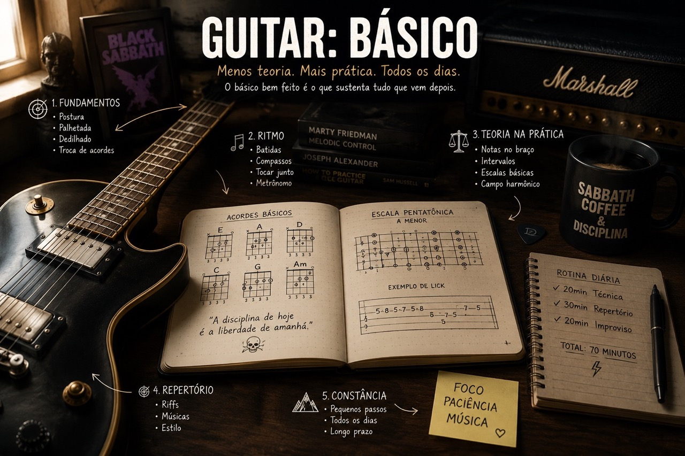

# Básico

## Boas-vindas

Este é o começo do guia.

Quando comecei a organizar essas anotações, a intenção era simples: juntar em um lugar só o que eu estava estudando e praticando. Com o tempo, isso virou um roteiro para voltar aos fundamentos sempre que alguma coisa parecia travada.

O básico não é uma fase para passar rápido. Afinação, postura, ritmo, acordes abertos, pestanas e escalas aparecem o tempo todo. Mesmo quando o assunto fica mais avançado, a dificuldade quase sempre volta para alguma dessas coisas.

Uso este repositório para guardar aulas, exercícios, referências de cursos, livros e treinos. Algumas páginas explicam conceitos. Outras são mais parecidas com lembretes de estudo ou listas de repertório.

Fique à vontade para sugerir melhorias e ajudar este guia a crescer.

<!-- 1. Anatomia da Guitarra
1. Conceitos Básicos
1. Postura
1. Tablatura
1. Notas no Braço
1. Afinação
1. Dedilhado 1
1. Diagrama
1. Acordes Essenciais Maiores e Menores Abertos
1. Mudanças de Acordes (Levadas em Mp3)
1. Exemplos de sequencias com acordes abertos
1. Ritmos e Levadas (Levadas em Mp3)
1. Power Chords (Levadas em Mp3)
1. Metrônomo
1. Escala Pentatônica com cordas soltas
1. Exercício pentatônico com cordas soltas (palhetada e ligado)
1. Escala Pentatônica lá menor
1. Exercícios pentatônico escala pentatônica de lá menor (palhetada e ligado)  1, 2, 3 e 4
1. Pestana
1. Exemplos de sequencias com pestana
1. Escala de Dó  Maior
1. Cronograma de Estudos
1. Repertório (Classic Rock base, solos básicos e punk rock) -->

## Básico 1

O primeiro bloco é para criar familiaridade com o instrumento. Antes de pensar em velocidade ou improvisação, vale saber onde estão as notas, como contar o tempo e como tocar sem tensionar as mãos.

1. Fundamentos da guitarra
2. Notas no braço do instrumento
3. Tom e Semitom
4. Acidentes Musicais
5. Partitura x Tablatura
6. Termos Técnicos da Guitarra
7. Técnica de Mão Direita - palhetada alternada
8. Postura e Técnica de Mão Esquerda
9. Escala Pentatônica
   1.  Formação
   2.  Padrões
   3.  Licks
   4.  Aplicação Prática
10. Harmonia Básica / Dicionário Básico de Acordes
11. Sequências Harmônicas (Aplicação)
12. Blues Playing
13. Teoria Elementar / Leitura Rítmica e Melódica
14. Repertório com aplicação dos itens acima mencionados (vários estilos: Rock, Pop, Funk, Blues, Country, Jazz)

Na prática, este módulo deve ajudar com perguntas bem diretas:

- Como afinar e segurar o instrumento sem criar tensão desnecessária?
- Onde estão as notas no braço da guitarra?
- Qual é a diferença entre tom, semitom e acidentes musicais?
- Como ler tablatura, partitura básica e figuras rítmicas?
- Como estudar com metrônomo sem transformar o treino em algo mecânico?
- Como aplicar acordes, levadas, licks e pentatônicas em músicas reais?

Técnica isolada ajuda, mas o repertório mostra se o assunto entrou mesmo na mão e no ouvido.

## Básico 2

O segundo bloco aprofunda o que já apareceu no primeiro. Aqui o estudo começa a sair do movimento isolado e vai para a fluência: ligar notas, visualizar oitavas, mudar de região, reconhecer padrões e improvisar com mais intenção.

1. Técnica II
   1. Ligadura
   2. Independência dos dedos
   3. Cromáticos
   4. Cordas Adjacentes
2. Escala Pentatônica II
   1. Padrões
   2. Licks
   3. Pentatônica Blues
   4. Improvisação / Blues Playing
3. Visualizando as oitavas em todas as regiões (preparação para o "Sistema 5")
4. Harmonia Básica II (harmonizando em diferentes regiões)
5. Teoria Elementar II / Leitura rítmica e melódica
6. Repertório com aplicação dos itens acima mencionados (vários estilos: Rock, Pop, Funk, Blues, Country, Jazz)

Os principais pontos de atenção são:

- Técnica 2: ligaduras, independência dos dedos, cromáticos e cordas adjacentes.
- Visualização das oitavas em todas as regiões.
- Pentatônica blues: padrões, licks e improvisação.
- Leitura rítmica e melódica.
- Pentatônica maior e menor: licks, padrões e diferentes formas de visualização.
- Harmonia básica 2 e harmonização em diferentes regiões.
- Pestanas.
- Repertório com aplicação em rock, blues, pop, funk e jazz.

O objetivo não é decorar uma lista grande. É começar a perceber relação entre escala, acorde, levada e música. Quando isso acontece, o estudo fica menos solto e a prática começa a fazer mais sentido.
